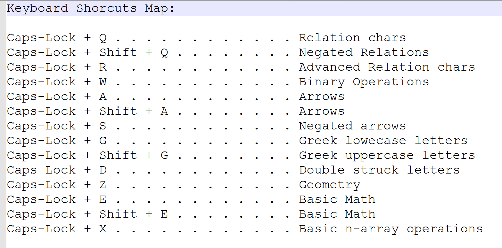

Based on SysWin (https://github.com/mjvh80/SymWin)

Download (x86/x64 Windows): https://github.com/Pavel-Durov/SymMath/releases/tag/0.1.0

# SymMath
A tool for quick math symbols insertion. Tested with Microsoft Word, but can be used in any text editor - as long as you got the right fonts installed :)   

